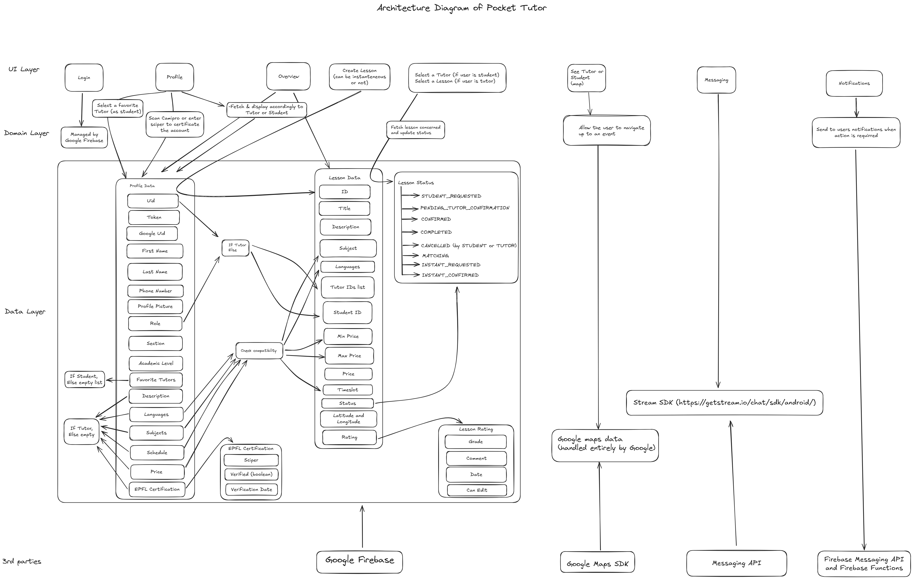

# PocketTutor

PocketTutor is an Android application designed to help students find tutors effortlessly based on their availability, budgets and location. This innovative platform leverages an advanced matching algorithm, ensuring that students are paired with the most suitable tutors for their academic needs.

## Find Your Perfect Tutor Easily!

At the heart of PocketTutor is a powerful matching algorithm that seamlessly connects students with tutors who are ready to assist them, ensuring an optimal learning experience. The algorithm takes into account the availability and academic level of each tutor, making it easier for students to find help when they need it the most.

In addition to the core matching functionality, PocketTutor offers several features to enhance the user experience. Students can bookmark their favorite tutors, allowing them to quickly reconnect with tutors they have had successful sessions with. This feature ensures that students can build strong, ongoing relationships with tutors who understand their learning style and needs.

PocketTutor also provides an option for tutors to certify their accounts by scanning their Camipro card, or directly using their sciper number. This certification process adds an extra layer of trust and security, ensuring that all users are legitimate students seeking academic assistance.

Notifications are another crucial aspect of the PocketTutor experience. Students receive timely reminders and updates, ensuring they never miss a scheduled session or important action. Whether it's a reminder for an upcoming lesson or a notification about a tutor's availability, students are always kept in the loop.

One of the standout features of PocketTutor is the ability to take instantaneous lessons. Students can quickly find available tutors and start a lesson immediately, based on their location, making it convenient for those urgent moments of need. This real-time connection allows for spontaneous and effective tutoring sessions, catering to the fast-paced demands of academic life.

## Features

- **Firebase Authentication**: Secure login via Google Sign-In.
- **Firestore Database**: Real-time data storage for user profiles, bookings, and reviews.
- **Google Maps API**: Location-based matching for in-person tutoring.
- **Cloud Functions**: Handles notification and automatic refresh of the lessons.
- **Cloud Messaging**: Real-time notifications for updates.
- **Camipro Scanner**: Verify tutor identity with Camipro card.
- **Photo Upload**: Upload profile picture for personalization.
- **Offline Mode**: Access key features without an internet connection.

## Design - Figma
Check out our [Figma Project](https://www.figma.com/design/tVPWUZqvvIcr7MgOULXYO9/Pocket-Tutor-Design?node-id=2020-339&t=NxpQOF9cLSAnxrlx-1) to see the design and user flow of the application. 

## Architecture Diagram
The following diagram illustrates the architecture of the PocketTutor application: 

